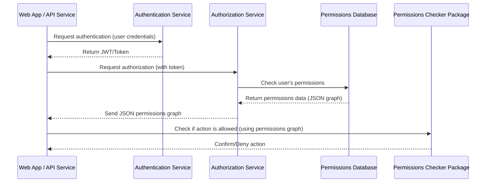
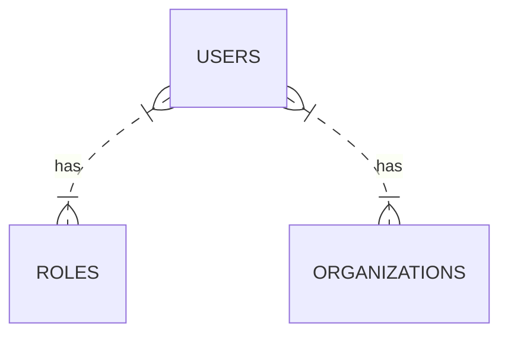
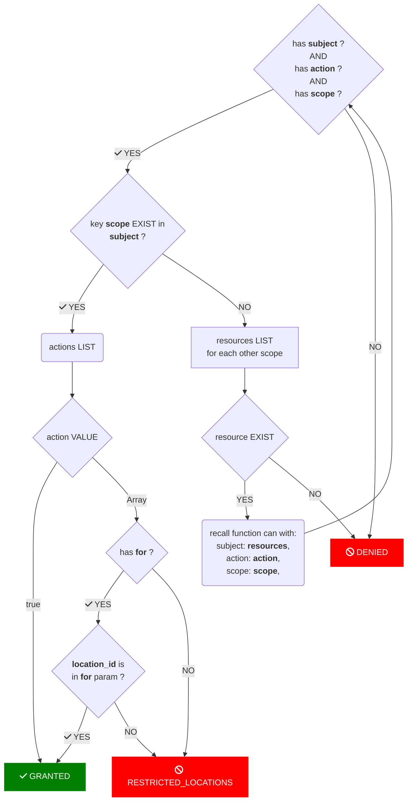

## Roles and permissions
---
### General concepts

> Workflow of an entity attempting to access to a resource. 




Web App / API Service
: Every user from a web app or an API service that need to access to a resource require to be authenticated by calling the `Authentication service`.


Authentication Service
: The authentication service is an API that require an user id and return a JWT if success.

Authorization Service
: Based on the JWT from an authenticated user, this service reach the permissions object with
the user id, the role id and the organization id.

Permissions Database
: The permissions database stores the permissions object of a role (see [Role model](#role-model) below).

Permissions Checker Package
: This package will return `GRANTED` or `DENIED` to the caller (web app or api service) who required an actions on a resources of a domain base on the permission context.

---
### Structure of the permissions JSON

#### Scopes
The structure of the permissions object of a role is made for an easy reading rule for a required action.
In the first node of object, we set the scope where we want the rules applies to. Here are the defined scopes:
- STATS
- POS_CONFIG
- THIRD_PARTIES
- BOOKINGS
- CUSTOMERS
- USER_ADMIN
- ORG_ADMIN
- "*": this wildcard scope define all scopes where the rules should applies

```json
  {
    STATS: ...,
    ...
  }
```

#### Actions
In the scope object we'll add the key `actions` which contains an object of actions related to the scope. The available actions are:
- read
- save
- delete
- create
- "*": this wildcard action define all actions allowed on a scope
Each action key is set to `true`. If not, or unset, the action is simply denied.

> locations restricted: In some case, you want to restrict actions for one or some locations. The value of the action is now an array of ids of location.

We could add special actions like `send-email` or `export` as actions

```json
  {
    STATS: {
      actions: {
        read: true,
        edit: [
          "id_location_1",
        ],
        send-mail: true,
        save: [
          "id_location_1",
          "id_location_3",
        ],
        ...
      }
    },
    BOOKINGS: {
      actions: {
        *: true
      }
    }
    ...
  }
```
*This role can access everything in the scope `STATS`, can access to the `send-mail` feature and can update but only for location with id `id_location_1` and save only for the locations with id `id_location_1` and `id_location_3`. It have full access on the scope `BOOKING`.*

#### Resources
The second key to add in a scope is the key `resources`. Resources contains sub-scope with theirs specifics actions. These resource have the same structure as the `scope` and may have their own resources.


```json

{
  CATALOG: {
    actions: {
      read: true,
    },
    resources: {
      PRODUCTS: {
        actions: {
          create: true,
          edit: true,
          save: true,
          export: [
            "id_location"
          ]
        },
      },
      TAXES: {
        actions: {
          edit: true,
          export: [
            "id_location"
          ]
        }
      }
    }
  },
  STATS: {
    actions: {
      read: true,
      edit: true,
      create: [
        "id_location_1",
        "id_location_3",
      ],
    }
  },
}
```
*This role have read-access to all the scope `catalog` and can also view, update and create in the `products` resource but can only export for the location with id "id_location". In the resource `taxes`, it allowed to update for all location but the export action is restricted to the location "id_location". It also can view and update the scope `STATS` and can create for locations `id_location_1` and `id_location_3` .*

If no resource is specified, all resources from the scope inherit from the scope actions rules.

---
### Storage and database schema {#role-model}



```
  {
    id:             String,
    users:          User[],   // relation to user table
    name:           String,
    organizationId: String?,  // no relation if null, support role else custom role
    permissions:    Jsonb,
    createdAt:      Date,
    updatedAt:      Date,
  }
```


---
### Function definition of `can`

The function `can` that requires as parameters the permission context, an action, a scope (or a resource) and, optionally, an array of location id, returns an object with the status `GRANTED`, `DENIED` or `RESTRICTED_LOCATION`.

```TS
function can(
    subject: PermissionContext,
    action: PermissionAction,
    scope: Scope | Resource,
    for?: Location[]
): | { status: "GRANTED" } 
   | { status: "DENIED", reason: String }
   | { status: "RESTRICTED_LOCATION", allowedLocation: String[], reason: String } {
    ...
```

#### Flowchart

This flowchart describes the process of checking permissions to do an action A on a resource R based in a scope S.



---
### Pending questions
- define correct actions: is `save` the same as `create` or `update` ?
- manage denied actions ? eg: `update: false`


#### Some coding

Here is an example of the `can` function
```ts
function can(
    subject: PermissionContext,
    action: PermissionAction,
    scope: Scope | Resource,
    for?: Location[]
): | { status: "GRANTED" } 
   | { status: "DENIED", reason: String }
   | { status: "RESTRICTED_LOCATION", allowedLocation: String[], reason: String } {
    // check params: has subject AND action AND scope ?
    if (!subject) return { status: "DENIED", reason: "subject missing" }
    if (!action) return { status: "DENIED", reason: "action missing" }
    if (!scope) return { status: "DENIED", reason: "scope missing" }
    
    // key scope EXIST in subject ?
    const currentScope = subject[scope];
    if (!currentScope) {
      // search in resource of each other domain
      const otherScopeResourcePermission = Object.keys(subject).reduce((prev, key) => {
        if (!subject[key].resources) return prev;
        // at least one resource match scope and action
        return can(subject[key].resources, action, scope, locations);
      }, { status: "DENIED", reason: "action or scope doesn't match permissions" })
      
      return otherScopeResourcePermission;
    }

    // actions LIST
    const actions = currentScope?.actions;
    // no actions found in this scope
    if (!actions) return { status: "DENIED", reason: "actions not found for scope ${scope}" }
    // wildcard: all actions granted
    if (actions['*']) return { status: "GRANTED" }
    // action VALUE
    const requestedAction = actions(action);
    // action is filtered by location
    if (Array.isArray(requestedAction)) {
      // has for ?
      if (!for) return { status: "RESTRICTED_LOCATION", reason: "locations filter missing" }
      // location_id (from action) is in for param ?
      const hasLocation = requestedAction.some(r=> for.indexOf(r) > -1)
      if (!hasLocation) return { status: "RESTRICTED_LOCATION", reason: "locations not allowed" }
    }
    // case action is set to false
    if (!requestedAction) return { status: "DENIED", reason: `action [${action}] in scope [${scope}] is forbidden` }

    return { status: "GRANTED" } 
}
```


#### Use case


Let's take for example this permission context

```ts
const permissions = {
  "STATS": {
    "actions": {
      "read": true,
      "edit": true,
      "sendMail": true,
      "save": [
        "id_location_1",
        "id_location_3"
      ]
    }
  },
  "BOOKING": {
    "actions": {
      "*": true
    }
  },
  "CATALOG": {
    "actions": {
      "read": true
    },
    "resources": {
      "PRODUCTS": {
        "actions": {
          "create": true,
          "edit": true,
          "save": true,
          "export": [
            "id_location"
          ]
        },
      },
      "TAXES": {
        "actions": {
          "edit": true,
          "export": [
            "id_location"
          ]
        }
      }
    }
  }
}
```

Examples
```ts
const canEditStats = can(permissions, 'read', 'CATALOG')
console.log(canEditStats)
// { status: 'GRANTED' }

const canSaveProduct = can(permissions, 'save', 'PRODUCTS')
console.log(canSaveProduct)
// { status: 'GRANTED' }

const canSendMailOwnedStats = can(permissions, 'sendMail', 'STATS', ['id_own_location'])
// { status: 'GRANTED' }

const canSendMailOwnedStats = can(permissions, 'save', 'STATS', ['id_own_location'])
// { status: "RESTRICTED_LOCATION", reason: "locations not allowed" }

const canExportProduct = can(permissions, 'export', 'PRODUCTS')
console.log(canExportProduct)
// { status: "RESTRICTED_LOCATION", reason: "locations filter missing" }

const canCreateTaxes = can(permissions, 'create', 'TAXES')
console.log(canCreateTaxes)
// { status: "DENIED", reason: "action [create] in scope [TAXES] is forbidden" }

const canEditUsers = can(permissions, 'edit', 'USERS')
// { status: "DENIED", reason: "action or scope doesn't match permissions" }
```


#### [DRAFT] Compiles permissions

```ts

const compileRules = (actions, scope, separator = ' ') => {
  if (!actions) return [];
  return Object.keys(actions).map(action => {
    const can = `can${separator}${action}${separator}${scope}`;
    if (actions[action] === true) return can;
    else {
      if (Array.isArray(actions[action])) {
        return actions[action].map(a => `${can}${separator}for${separator}${a}`);
      }
      else return Object.keys(actions[action]).map(a => `${can}${separator}${a}`);
    }
  }).filter(p => p);
};


const compilePermissions = (data, separator = ' ', parentScope) => {
  if (!data) return [];
  return Object.keys(data).reduce((prev, key) => {
    const scope = data[key];
    const { actions, resources } = scope;

    const compiledScope = (parentScope) ? `${parentScope}${separator}${key}` : key;
    if (!actions) {
      prev.push(`${compiledScope} DENIED`);
      return prev;
    }

    const rules = compileRules(actions, compiledScope, separator);

    prev = prev.concat(rules.reduce((p, r) => {
      if (typeof r === 'string') {
        p.push(r)
      }
      else {
        p = p.concat(r)
      }
      return p
    }, []));

    if (resources) {
      const resourcesRules = compilePermissions(resources, separator, key);
      prev = prev.concat(resourcesRules);
    }

    return prev;
  }, [])
}


compilePermissions(permissions, '|')

returns [
  "can|read|stats",
  "can|edit|stats",
  "can|sendMail|stats",
  "can|save|stats|for|id_location_1",
  "can|save|stats|for|id_location_3",
  "can|*|booking",
  "can|read|catalog",
  "can|create|catalog|products",
  "can|edit|catalog|products",
  "can|save|catalog|products",
  "can|export|catalog|products|for|id_location",
  "can|edit|catalog|taxes",
  "can|export|catalog|taxes|for|id_location",
]
```
